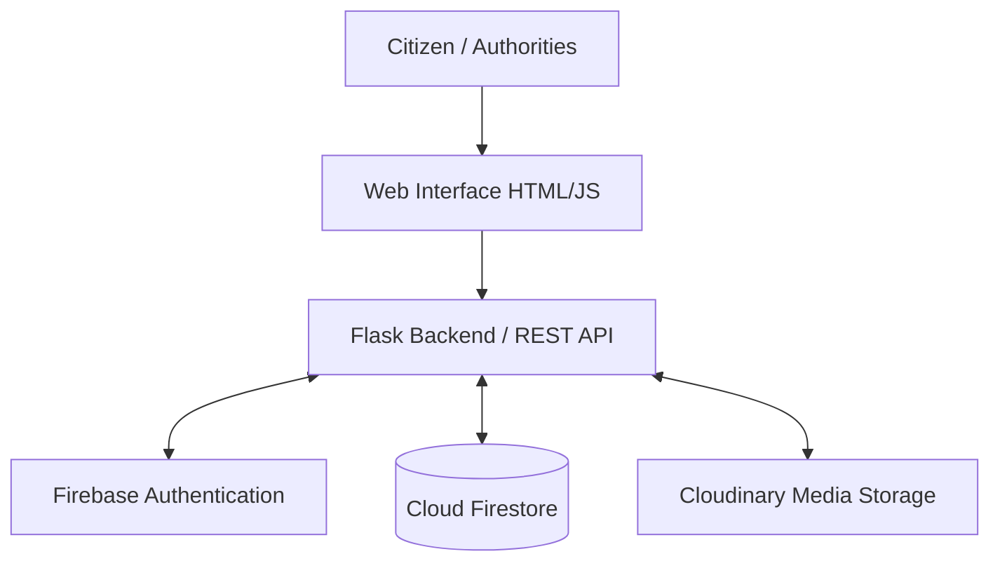
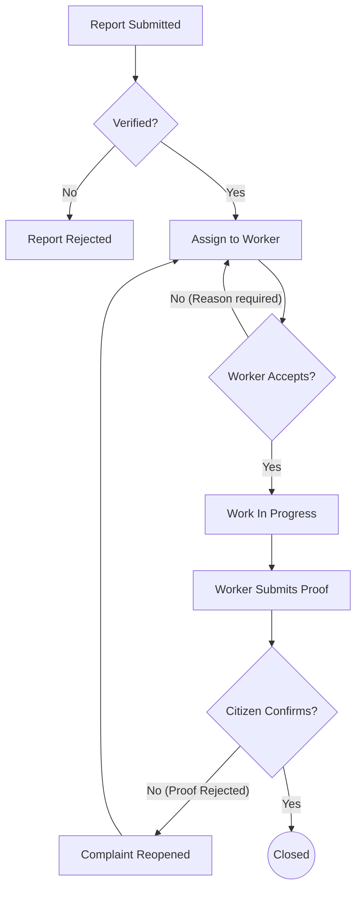

# SnapFix — Smart City Management System

SnapFix is a comprehensive civic tech platform that transforms unstructured civic complaint reporting into a strictly structured, traceable accountability workflow. It ensures that every reported issue is permanently tracked, verified, routed to the right personnel, proven resolved with evidence, and ultimately confirmed by the citizen who reported it.

**Hackathon**: BIT N BUILD Hackathon 2026  
**Team**: DATABREACH  
**Track**: Jan Jeevan

---

## 🚀 Key Idea

The core of SnapFix revolves around an end-to-end accountability lifecycle:

**REPORT → VERIFY → ASSIGN → SOLVE → PROVE → CONFIRM → CLOSE**

Unlike basic complaint-registration systems where issues are submitted into a void, SnapFix enforces accountability at every stage. A complaint is not truly "closed" when a worker claims it is done; it must be proven with photographic evidence and confirmed by the reporting citizen. If rejected, the issue is reopened, preserving the full audit trail.

---

## 🎯 Problem Statement

Traditional civic reporting mechanisms suffer from critical inefficiencies:
- **Black Hole Effect**: Complaints become difficult to track after submission, leaving citizens in the dark.
- **Flooded & Duplicate Reports**: Authorities are overwhelmed with unstructured, duplicate reports.
- **Unclear Responsibility**: Lack of role-based routing causes issues to bounce between departments.
- **Lack of Resolution Proof**: Field workers close tickets without providing verifiable proof of work.
- **No Citizen Confirmation**: Citizens have no say in confirming if the issue was actually resolved properly.
- **Poor Visibility**: City administrators lack a clear, transparent view into the complete lifecycle of civic issues.

---

## 💡 Solution

SnapFix solves these problems by securely connecting **Citizens → Departments → Service Workers → Administrative Authorities** into a single, cohesive ecosystem. 

When a citizen reports an issue, SnapFix generates a permanent **Report ID**. The issue is verified by authorized authorities, converted into a task, and strictly assigned to a Service Worker. The worker accepts the task, performs the job, and submits photographic proof. The citizen then reviews this proof—confirming it to close the issue, or rejecting it to reopen the complaint. The entire lifecycle is recorded in a permanent audit history, supported by dynamic priority calculations, deadlines, and escalation paths.

---

## ✨ Features

### Citizen
- **Create Complaints**: Submit structured issues including category, description, location, and seriousness.
- **Evidence Upload**: Attach photographic evidence to support the report.
- **Permanent Report ID**: Track complaints uniquely via an immutable Report ID.
- **Edit / Delete**: Modify or remove complaints while they are still in the `PENDING_VERIFICATION` stage.
- **Public Wall**: View, filter, search, and support community complaints in a public forum.
- **Review Proof**: Evaluate photographic proof submitted by field workers.
- **Confirm / Reject**: Confirm the resolution to officially close the complaint, or reject unsatisfactory proof to reopen it.

### Administrative Hierarchy
SnapFix enforces strict server-side authorization through a defined hierarchy:

1. **MAIN AUTHORITY**: Highest administrative oversight across all city operations.
2. **CITY ADMIN**: City-wide administration and oversight.
3. **DEPARTMENT HEAD**: Department-specific verification, assignment, and personnel management.
4. **SERVICE WORKER**: Field execution, assignment acceptance, and proof submission.

*(Note: The Citizen role is public-facing and operates outside the internal administrative hierarchy).*

### Complaint Verification & Priority
- **Authorized Verification**: Complaints must be explicitly reviewed and verified by an authority (e.g., Department Head) before becoming actionable tasks.
- **Dynamic Priority Formula**: Priority is automatically calculated based on **Seriousness + Days Passed + Supporters**.
- **Department Scoping**: Issues are managed and assigned within their relevant departments.

### Worker Workflow
- **Availability State**: Workers can manually toggle their availability (`AVAILABLE` / `OFFLINE`).
- **Assignment State**: Tasks move through explicit states: `Pending Acceptance`, `Accepted / Assigned`, and `In Progress`.
- **Accountability**: Workers must accept or reject assignments. Rejections require a reason, which is permanently logged in the complaint's history for reassignment.
- **Start Work & Submit Proof**: Workers log when work begins and conclude by uploading photographic proof of resolution.

### Proof & Citizen Confirmation
- **Photographic Proof**: Workers must submit an image demonstrating the resolved issue.
- **Citizen Review**: The reporting citizen has the final say in closing the loop.
- **Reopening Loop**: If a citizen rejects the proof, the complaint reopens, preserving the rejected proof in the history. The worker whose proof was rejected cannot be reassigned to the same reopened complaint.

### Escalation & Extensions
- **Escalation Path**: If issues are stalled or repeatedly reopened, they can be manually escalated up the hierarchy: 
  `Citizen/Service Worker → Department Head → City Admin → Main Authority`.
- **Deadline Extensions**: Workers can request official deadline extensions, requiring higher authority approval.

### Audit History
- **Permanent Audit Trail**: Every complaint maintains a chronological, historical timeline tracking precisely who acted, what happened, when it occurred (localized to India Standard Time), and why.
- **Tracked Events**: Includes CREATED, EDITED, VERIFIED, REJECTED, ASSIGNED, WORK_STARTED, PROOF_SUBMITTED, PROOF_REJECTED, REOPENED, ESCALATED, CITIZEN_CONFIRMED, FALSE_REPORT, and CLOSED.

### Worker Performance
- **Historical Metrics**: Worker performance is derived automatically from real workflow data, tracking total assignments, successful citizen-confirmed completions, extension requests, and reopened tasks.

### User Management
- **Role & Access Protection**: Administrators can manage roles and explicitly ban/unban users. Banned users are instantly blocked at the backend and forced to sign out.

### Public Wall
- **Community Forum**: A public dashboard allowing citizens to see reported complaints.
- **Support Mechanism**: Citizens can upvote issues, naturally boosting their priority and visibility.
- **Categorization**: Includes advanced filtering and searching by complaint category and status.

---

## 🏗️ System Architecture

**Frontend**
- HTML / Jinja Templates
- Vanilla JavaScript
- Pure CSS

**Backend**
- Python
- Flask (REST/API endpoints)

**Authentication**
- Firebase Authentication

**Database**
- Cloud Firestore (NoSQL Document DB)

**Media Storage**
- Cloudinary (Image upload and delivery)

**Production Server**
- Gunicorn (Deployed on Render)



---

## 🔄 Complaint Lifecycle



---

## 👥 Roles & Responsibilities

| Role | Responsibility |
|------|----------------|
| **Main Authority** | City-wide / highest administrative oversight and escalation handling. |
| **City Admin** | City-wide administration, oversight, and user management. |
| **Department Head** | Department-specific verification, assignment, and worker management. |
| **Service Worker** | Field execution, assignment acceptance, work tracking, and proof submission. |
| **Citizen** | Reporting, tracking, supporting community issues, and confirming/rejecting resolution. |

---

## 🛠️ Technology Stack

| Layer | Technology |
|-------|------------|
| **Frontend** | HTML, CSS, Vanilla JavaScript, Jinja |
| **Backend** | Python, Flask |
| **Authentication** | Firebase Authentication |
| **Database** | Cloud Firestore |
| **Media Storage** | Cloudinary |
| **Server/Deployment** | Gunicorn, Render |

---

## 🔐 Security & Access Control

- **Firebase Authentication**: Secures all user accounts and sessions.
- **Server-Side Role Checks**: All protected routes enforce strict Role-Based Access Control (RBAC) via backend middleware.
- **Department Scoping**: Department Heads can only manage workers and complaints within their specific department jurisdiction.
- **Ownership Verification**: Actions like editing or deleting a pending complaint, or confirming proof, verify the `citizen_id` against the active session token.
- **Banned User Restrictions**: Banned users are forcefully logged out and blocked by API endpoints based on their authoritative Firestore `account_status`.

---

## ☁️ Deployment

SnapFix is designed to be deployed into production using:
- **Hosting**: Render (Web Service)
- **WSGI Server**: Gunicorn
- **Environment Management**: Secrets and configurations (Firebase Admin credentials, Cloudinary URL, Secret Key) are passed securely via environment variables.

*(Note: Never commit your secrets. Always configure `.env` or standard environment variables in your deployment portal).*

---

## 🧪 Testing

The repository includes a suite of test scripts verifying essential logic blocks. 

Currently implemented test suites include:
- `test_authority_sync.py`
- `test_authz.py`
- `test_dashboard_roles.py`
- `test_workflow.py`

To execute the test suite locally, ensure your virtual environment is active and run:

```bash
pytest
```
